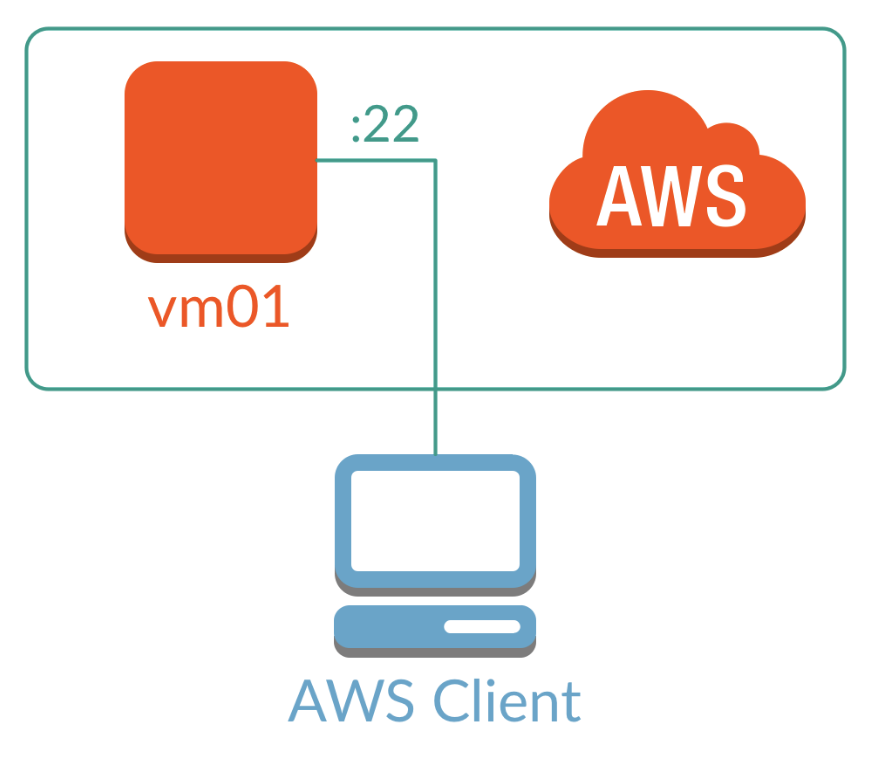

name: title
class: center, middle, inverse

# Resource Quotas
---
class: center, middle, inverse



---
class: inverse

```
# May I use comments here?

$ cf create-space-quota small-space-quota -i 512M -m 2048M -r 10 -s 5
```

__Yes! Sure__

---
name: objectives
class: inverse


#  01. Objectives

1.	Introduction
2.	Listing quotas
3.	Getting quota info
4.	Creating and managing quotas
5.	Assigning quotas
6.	Space quotas
---
class: inverse

# 02. Introduction

Cloud Foundry offers a convenient way to manage available resources, such as disk, memory, and even paid services. This is done through **Quotas** or namesets, which are an easy way to remember a configuration for a specific resource management plan.


---
class: inverse

The structure of a quota is comprised of the following:

-	**name**: a name you will use to identify the plan; it should be easy to remember
-	**instance memory limit**: the maximum amount of memory that an instance can use, e.g., `256M` or `2G`
-	**memory limit**: the maximum amount of memory allowed to be used in the plan, e.g., `512M` or `1G`


---
class: inverse


-	**total routes**: the maximum number of routes allowed for the plan
-	**total services**: the maximum number of services allowed in the plan
-	**non basic services allowed**: setting this value to `true` will allow users to provision non-free service plans


---
class: inverse


Listing quotas
--------------

Let's list the built-in plans:

```bash
cf quotas
```

As you can see, there is only one quota right now, which is the `default` quota.


---
class: inverse


Getting quota info
------------------

It is also possible to get the same information in a more easy-to-read way:

```sh
cf quota default
```
---
class: inverse

Creating and managing quotas
----------------------------

Creating a quota is very straightforward. Let's see the options:

```sh
cf help create-quota
```

**Reminder:** You can get help on a CLI command by doing `cf help command-name`.

Now that we know what modifiers to use, we can create our first quota:

```sh
cf create-quota small-quota -i 512M -m 2048M -r 10 -s 5
```

This command has created a quota with the following limits:

* maximum instance memory (`-i`): 512M
* maximum memory allocation for all instances (`-m`): 2048M
* maximum number of routes (`-r`): 10
* maximum number of services (`-s`): 5 

---
class: inverse

Note that you didn't use the `--allow-paid-service-plans` flag, which immediately sets that parameter to `false`.

If you list the quotas again, you'll see that your newly created quota is there.

```
$ cf quotas
```

Let's create a second quota, a larger one that allows paid plans:

```sh
cf create-quota large-quota -i 2048M -m 10G -r 100 -s 20 --allow-paid-service-plans
```

---
class: inverse

Listing the quotas again will show that `large-quota` has been created and is available.

---
class: inverse

Modifying a quota
-----------------

It is very likely that, at some point, you are going to realize that one or many of the limits set by your quota are too strict and users are running low on resources, or that you need to limit a quota even more due to overusage.

Modifying - or *updating* - a quota is very simple in Cloud Foundry. The format is almost the same as in the `create-quota` command.

```sh
cf update-quota large-quota --disallow-paid-service-plans
```

Now, users of this quota will not be able to provision any paid services.

Also, we can modify any other quota parameter as we see fit:

```sh
cf update-quota small-quota -i 256M -s 2
```

As you can see, there is no need to re-specify all the parameters of a quota, except for the ones we need to modify.

Assigning quotas
----------------

Now that we have created a quota, we can apply it to an org:

```sh
cf set-quota riman large-quota
```

If you query `riman` details, you will see that the quota has been assigned to it:

```sh
cf org riman
```

**Caveat**: It is not possible to remove a quota from an org, once it has been assigned.

Deleting a quota
----------------

Removing a quota definition from the system can be accomplished with:

```sh
cf delete-quota small-quota
```

**Reminder:** You can always use the `-f` modifier to force a command without confirmation.

Space quotas
------------

Space quotas are the same as regular quotas, but they can be assigned to specific spaces instead of orgs. The only difference is that, unlike with orgs, you can remove a quota from a space.

Creating (`create-space-quota`), updating (`update-space-quota`), and deleting (`delete-space-quota`) work exactly as their "regular" quota counterparts. Setting and unsetting space quotas to a space have some minor differences:

Create a space quota with:

---
class: left, middle 

```bash

cf create-space-quota small-space-quota -i 512M -m 2048M -r 10 -s 5
export KUBERNETES_URL="https://10.0.0.1:6443"

# Let's look..
cat > my.yaml <<EOF
- name: lexsys
  surname: *
EOF

echo $KUBERNETES_URL
# https://10.0.0.1:6443
```

.center[I don't know what to type]

???

- describe what kubernetes is
- what browser does k8s dashboard support?
- where is dashboard hosted?

---

Now modify it:

```sh
cf update-space-quota small-space-quota -i 128M
```

Assign the quota to your space:

```sh
cf set-space-quota hyper small-space-quota
```

Now, get the information for your space:

```sh
cf space hyper
```

As you can see, the space quota now appears in the space information, confirming that it was added successfully.

The biggest difference between a space quota and an org quota is that a space quota can be unassigned:

```sh
cf unset-space-quota hyper small-space-quota
```

Before you complete this section, set the previously unset space quota back to the `hyper`.

Also, you can list all the space quotas or get information about a specific one, using the `space-quotas` and `space-quota` commands.

Try them!

